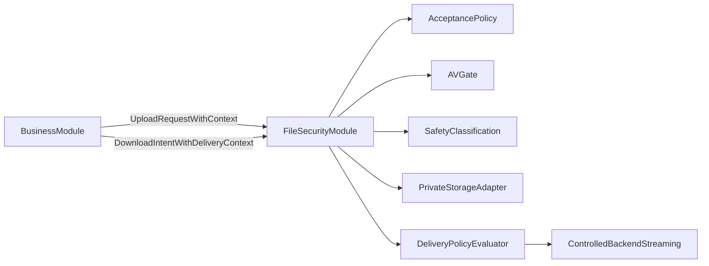

# Архитектурный план безопасной загрузки файлов (университетский портал)

Финальная версия архитектурного документа для команды разработки.

---

## 1. Краткая архитектурная оценка подхода

Подход «принимать широкий спектр пользовательских файлов, но гарантировать их неисполнение и контролируемую выдачу» подходит для университетского портала, потому что:
- образовательные сценарии по природе разнообразны (исходники, документы, архивы, нестандартные форматы), и жёсткий allowlist быстро блокирует легитимные учебные кейсы;
- ключевой риск здесь не сам факт хранения файла, а его исполнение/рендеринг в опасном контексте;
- архитектурная модель с безопасной выдачей и неизменяемой классификацией лучше масштабируется под будущие use-case'ы.

Безопасность этого подхода достигается только при одновременном выполнении условий:
- storage не используется как публичный канал раздачи;
- выдача идёт через контролируемый delivery-слой с жёсткими правилами;
- файл до активации недоступен для bind/download (см. раздел про activation gate);
- security-решения не опираются на extension или client MIME как единственный сигнал;
- обязательные проверки (включая AV) fail-closed.

Преимущества:
- гибкость для учебного контента;
- расширяемость политик без переписывания ядра (OCP);
- явное разделение «принят/хранится» vs «как и где может быть выдан».

Ограничения:
- выше архитектурная сложность (статусы, политики, governance);
- потребуется дисциплина в интерфейсах между модулями;
- для специализированного безопасного inline/preview нужны отдельные сценарии и отдельные политики.

---

## 2. Целевая архитектурная модель

### 2.1 Границы модулей

- **Бизнес-модули портала (доменные контексты):** домашние задания, материалы уроков, документы и т.д.
  - отвечают за бизнес-сущности и права доступа к своим объектам;
  - хранят ссылку на файл через стабильный `FileRef`/`FileId` (без knowledge о storage internals).
- **Технический файл-модуль (file security/storage domain):**
  - единая точка приёма, проверки, классификации, хранения, выдачи и удаления файлов;
  - владеет политиками `acceptance`, `classification`, `delivery`;
  - владеет жизненным циклом и статусами файла;
  - владеет интеграцией AV и другими обязательными проверками.

### 2.2 Распределение ответственности

- **Приём файла:** только файл-модуль.
- **Валидация (базовая техническая):** только файл-модуль.
- **Антивирус:** только файл-модуль (обязательный gate).
- **Решение о допуске и присвоении класса безопасности:** только файл-модуль по выбранному upload context.
- **Сохранение в storage:** только файл-модуль через внутренний storage adapter.
- **Выдача:** только файл-модуль (или строго контролируемый presigned flow при гарантиях response governance).
- **Удаление:** только файл-модуль, только через его API; удаление по raw storage key запрещено (см. раздел 8).

### 2.3 Почему бизнес-модуль не должен знать техдетали файла

Бизнес-модуль не должен знать MIME, AV, traversal, storage path и delivery headers, потому что:
- это кросс-срезовые security-правила, которые должны быть централизованы;
- дублирование правил в бизнес-коде ведёт к расхождениям и уязвимостям;
- OCP достигается расширением policy-плагинов в file-модуле, а не массовыми изменениями в доменах.

---

## 3. Модель политик и классификации файла

### 3.1 Три отдельные политики (обязательное разделение)

1. **Acceptance policy (можно ли принять файл):**
   - решает `accept/reject` для входящего потока в upload context;
   - учитывает размер, базовые ограничения формата/структуры, минимальные технические проверки, обязательный AV.

2. **Storage/use classification (какому классу использования принадлежит файл):**
   - после принятия файл получает фиксированный **FileSafetyClass**;
   - класс описывает максимально допустимое использование (например, только controlled download);
   - после перехода в `ACTIVE` класс считается **immutable**; изменение возможно только через отдельный явный flow re-validation / re-classification, а не через reuse файла в новом контексте или смену контекста выдачи.

3. **Delivery policy (как файл можно отдавать в конкретном сценарии):**
   - решение принимает пересечение двух ограничений:
     - ограничений, зафиксированных у файла (`FileSafetyClass`);
     - ограничений текущего `DeliveryContext`.
   - если контекст просит «более опасное» поведение, чем разрешает класс файла, запрос отклоняется или понижается до более строгого режима.

### 3.2 Ключевое правило доверия

- Новый контекст **не может повысить доверие** к уже сохранённому файлу.
- Возможен только тот же или более строгий режим использования.
- Следствие: «accepted file» != «safe to render inline».

### 3.3 Стартовый сценарий (GeneralUserFileFlow)

- Acceptance: допускается широкий набор форматов (кроме явно недопустимых/вредоносных по политике).
- Classification: присваивается базовый класс «неисполняемый пользовательский бинарный объект общего назначения».
- Delivery: **только attachment/download**, без доверия MIME как источнику security behavior.
- Сохранённый MIME — метаданные/подсказка для аналитики/UX, но **не** основание security decision.

### 3.4 Контексты загрузки и выдачи (OCP)

- Вводятся явные `UploadContext` и `DeliveryContext` как декларативные ключи выбора политики.
- Добавление нового сценария (например, avatar upload):
  - добавляется новый context + новые policy-реализации;
  - ядро пайплайна и существующие контексты не переписываются.
- Запрещается «размазанный выбор» политик по контроллерам/сервисам разных модулей.

---

## 4. Activation gate

Файл может быть **физически сохранён** в storage до завершения всех обязательных проверок (например, во временной области или в состоянии «ожидание проверки»). Однако он становится **доступным для привязки (bind) и скачивания (download)** только после:

1. полного завершения mandatory checks (включая AV);
2. присвоения `FileSafetyClass`;
3. перехода в статус `ACTIVE`.

До этого момента любой запрос на bind или download должен отклоняться. Это **обязательное архитектурное требование** (activation gate): доступность файла для использования в системе жёстко привязана к прохождению gate, а не к факту наличия байтов в storage.

---

## 5. Жизненный цикл файла и статусы

Минимальная статусная модель:
- `RECEIVED_TEMP` — файл принят во временную область, ещё не допущен к использованию.
- `PENDING_SECURITY_CHECKS` — выполняются обязательные проверки (вкл. AV).
- `ACTIVE` — проверки пройдены, присвоен safety class, файл разрешён к bind/download в рамках своего класса (после activation gate).
- `REJECTED` — отклонён политикой/проверками.
- `DELETED` (или `SOFT_DELETED`) — удалён; **терминальное недоступное состояние**: файл не выдаётся, не участвует в bind, не может быть «восстановлен» для выдачи без явного re-upload/re-validation.

Зачем статусная модель нужна даже при синхронном сканировании сейчас:
- даёт устойчивый контракт на будущее (асинхронные проверки, очереди, ретраи);
- явно отделяет «получили байты» от «разрешили использование»;
- исключает race-condition, где файл успевают привязать/скачать до завершения обязательных проверок.

Жёсткое правило:
- пока файл не `ACTIVE`, он не может:
  - быть привязан к бизнес-сущности;
  - быть выдан на скачивание/просмотр;
  - участвовать в downstream обработках.

---

## 6. Controlled delivery: обязательный контракт для общего пользовательского file flow

Для общего пользовательского file flow **controlled delivery** является обязательным архитектурным требованием, а не рекомендацией. Он должен **исключать**:

- **Browser MIME sniffing** — ответ не должен позволять браузеру переопределять объявленный content-type и интерпретировать тело по своему усмотрению; используются заголовки, явно запрещающие sniffing (например, `X-Content-Type-Options: nosniff`), и выдача только как attachment.
- **Inline interpretation** — файл не отдаётся для отображения в контексте страницы (inline); выдача только как **download/attachment** с соответствующими response headers.

Таким образом, в базовом сценарии общий пользовательский файл:
- отдаётся только как attachment/download;
- с безопасными response headers, навязывающими поведение «скачать, не исполнять и не интерпретировать inline»;
- сохранённый MIME — лишь метаданные/подсказка, а не основа security decision.

---

## 7. Original filename и metadata

- **Original filename** — только **display metadata**. Он не является доверенным вводом и не должен использоваться **без нормализации и санитизации** в:
  - HTTP-заголовках (например, `Content-Disposition`);
  - UI, логах и любых других местах отображения.
- Нормализация/санитизация обязательна перед любым использованием имени в ответах или логах (защита от path traversal, control characters, небезопасных символов, чрезмерной длины).
- **Metadata** (включая client-provided MIME, имя и т.д.) остаются **недоверенными по умолчанию** и не используются как единственное основание для security-решений.

---

## 8. Удаление и orphan handling

- **Удаление файла** допускается **только через API файл-модуля**. Удаление по raw storage key (обход файл-модуля) **запрещено** — это нарушает единую точку контроля lifecycle и может обойти проверки на привязки и аудит.
- Состояние **DELETED** — **терминальное**: файл недоступен для выдачи и bind; восстановление для выдачи возможно только через новый upload и прохождение полного пайплайна (не «реанимация» старой записи).
- **Orphaned files** (файлы, на которые больше не ссылается ни одна бизнес-сущность): политика обработки должна быть определена в рамках файл-модуля (например, периодическая очистка по правилам retention, только через тот же модуль и с учётом статусов). Удаление сирот — только через файл-модуль, с учётом lifecycle и при необходимости аудита.

---

## 9. Архивы (усиленная модель)

Для базового сценария:
- архив рассматривается как **opaque binary object**;
- сервер не трактует его как контейнер доменных файлов;
- запрещены авто-распаковка/индексация/превью/выборочное чтение содержимого в общем флоу.

Если в будущем нужна распаковка:
- это отдельный сценарий с отдельным context и отдельной архитектурой;
- изоляция вычислительной среды, лимиты на ресурсы, отдельные policy и security-review обязательны;
- нельзя «включить распаковку» внутри общего пользовательского потока.

---

## 10. Обязательные инварианты системы

1. Загруженный файл никогда не исполняется платформой доставки.
2. Storage не является публичным каналом раздачи.
3. Пользовательские имя/metadata не влияют на физический путь хранения.
4. Все metadata недоверенные по умолчанию; original filename используется только после нормализации/санитизации.
5. `ACTIVE` — единственный статус, разрешающий bind/download; доступ только после прохождения activation gate.
6. До завершения обязательных проверок и перехода в `ACTIVE` файл недоступен для использования.
7. После активации `FileSafetyClass` immutable; изменение только через явный re-validation/re-classification flow.
8. Новый контекст не может повысить FileSafetyClass ранее загруженного файла.
9. DeliveryContext не может ослабить ограничения FileSafetyClass.
10. Security-решения не принимаются только по extension или client-provided MIME.
11. MIME в general flow не является основанием для inline-поведения.
12. Общий пользовательский файл отдаётся только как attachment/download; controlled delivery исключает browser sniffing и inline interpretation.
13. Raw object URL не используется клиентом как контракт доступа к файлу.
14. AV обязателен; при его недоступности действует fail-closed.
15. Архивы в общем потоке — только непрозрачные бинарные объекты.
16. Повторное использование файла в новом бизнес-контексте возможно только при соблюдении исходных ограничений класса и текущей delivery policy.
17. Удаление — только через файл-модуль; удаление по raw storage key запрещено.
18. Состояние DELETED — терминальное и недоступное для выдачи и bind.

---

## 11. Риски и архитектурные контрмеры

- **Path traversal / manipulation:** storage key генерируется системой; user filename никогда не участвует в path; использование имени в headers только после нормализации/санитизации.
- **Double extensions / misleading names:** имя файла не участвует в security decision; рассматривается как display metadata.
- **Content-type spoofing:** client MIME — недоверенный сигнал; policy опирается на серверный контроль и класс безопасности.
- **MIME sniffing / dangerous browser rendering:** для general flow только attachment + безопасные response headers (включая запрет sniffing) + запрет inline; зафиксировано как обязательное требование controlled delivery.
- **Public bucket / direct object URL:** private storage + controlled delivery gateway; отсутствие публичных raw ссылок.
- **Archive abuse / zip bomb:** архив не распаковывается в общем флоу; лимиты размера и политики приёма.
- **Too large files / resource exhaustion:** лимиты размера и поточного приёма, early rejection до дорогих операций.
- **Cross-context reuse to escalate trust:** immutable FileSafetyClass + delivery by intersection (class ∩ context).
- **Смешение «safe to store» vs «safe to render»:** отдельные policy-слои (acceptance/classification/delivery) и явные контексты.
- **Trust in original metadata:** metadata хранится как справочная, но не security-authoritative; filename только после санитизации.

---

## 12. Presigned URL: архитектурные требования

- Presigned URL допустим только если storage/delivery слой гарантированно навязывает безопасное response-поведение (в т.ч. attachment и защитные заголовки) и это не может быть обойдено клиентом.
- Если это гарантировать нельзя, general user file выдаётся только через backend streaming endpoint.
- Временность URL сама по себе не делает выдачу безопасной; `temporary != safe`.

---

## 13. Роль антивируса

- AV обязателен как один из gate-слоёв acceptance pipeline.
- AV не является достаточным и главным слоем, потому что:
  - сигнатуры и эвристики не покрывают неизвестные/новые угрозы;
  - возможны false negative.
- Архитектура должна оставаться безопасной даже при пропуске неизвестного вредоносного файла:
  - ключевая защита — невозможность исполнения/опасного рендеринга и контролируемая выдача.
- При обязательной AV-политике недоступность AV = `fail-closed` (нет активации файла).

---

## 14. Auditability и observability

Архитектура должна позволять понимать:
- **почему файл был отклонён** (какая политика/проверка, код/причина);
- **почему файл был активирован** (пройденные проверки, присвоенный safety class);
- **почему выдача была разрешена или отклонена** (разрешённый delivery context, пересечение с классом файла).

Policy resolution и security gating **не должны быть «чёрным ящиком»**: решения о accept/reject, присвоении класса и допуске к выдаче должны быть логируемыми и при необходимости трассируемыми (без утечки чувствительных данных), чтобы можно было проводить разбор инцидентов и аудит.

---

## 15. Future caution: дедупликация по hash

Если в будущем будет введена дедупликация по содержимому (hash):
- **одинаковое содержимое не означает одинаково допустимый use context** — два загрузчика могли загрузить один и тот же файл в разных контекстах с разными политиками;
- дедупликация **не должна ломать** lifecycle, присвоенный safety class и delivery restrictions уже существующей записи;
- повторное использование «того же» файла по hash в новом контексте должно подчиняться тем же правилам: нельзя повышать trust level; выдача — только в рамках класса уже сохранённого файла и текущего delivery context;
- при необходимости отдельная запись с собственным lifecycle и классом предпочтительнее, чем неявное «повышение» прав общей записи.

---

## 16. Пошаговый план внедрения

1. Зафиксировать security invariants и контракт controlled delivery как обязательные архитектурные требования.
2. Выделить централизованный file security/storage модуль.
3. Ввести явные UploadContext и DeliveryContext.
4. Разделить policy-уровни (acceptance, classification, delivery) с единым policy resolver.
5. Ввести FileSafetyClass как неизменяемую после активации характеристику; явный re-validation/re-classification flow для изменения.
6. Ввести понятие activation gate и статусный lifecycle; запрет bind/download до ACTIVE.
7. Реализовать контролируемую выдачу для стартового сценария: только attachment/download, безопасные headers, исключение sniffing и inline interpretation.
8. Закрыть storage от публичной раздачи; presigned только при доказуемом response governance.
9. Интегрировать обязательный AV в fail-closed режиме.
10. Утвердить архивную политику как opaque-by-default; отдельный roadmap для специализированного archive-processing.
11. Зафиксировать правила удаления и orphan handling только через файл-модуль; DELETED как терминальное состояние.
12. Обеспечить auditability: логирование/трассировка решений политик и gating.
13. Ввести архитектурные тесты и контроль соблюдения инвариантов.

---

## 17. Что нельзя делать (архитектурные запреты)

- Нельзя отдавать общий пользовательский контент inline.
- Нельзя делать storage публичным каналом выдачи.
- Нельзя использовать raw file URL в клиенте как основной способ доступа.
- Нельзя считать «файл принят» эквивалентом «его можно безопасно показывать где угодно».
- Нельзя повышать trust level файла из-за нового use case или reuse в другом контексте.
- Нельзя менять FileSafetyClass после активации иначе как через явный re-validation/re-classification flow.
- Нельзя разрешать bind/download до прохождения activation gate (пока статус не ACTIVE).
- Нельзя автоматически распаковывать архивы в общем пользовательском флоу.
- Нельзя принимать security decisions по одному только extension или MIME.
- Нельзя разрешать bind/download неподтверждённого (не ACTIVE) файла.
- Нельзя размазывать выбор policy по разным бизнес-модулям.
- Нельзя трактовать временный presigned URL как безопасный по умолчанию.
- Нельзя допускать browser MIME sniffing и inline interpretation для общего пользовательского file flow — controlled delivery с запретом sniffing и только attachment обязательны.
- Нельзя использовать original filename в headers, UI или логах без нормализации/санитизации.
- Нельзя удалять файл по raw storage key; удаление только через файл-модуль.
- Нельзя при дедупликации по hash ослаблять lifecycle, safety class или delivery restrictions уже сохранённого файла.
